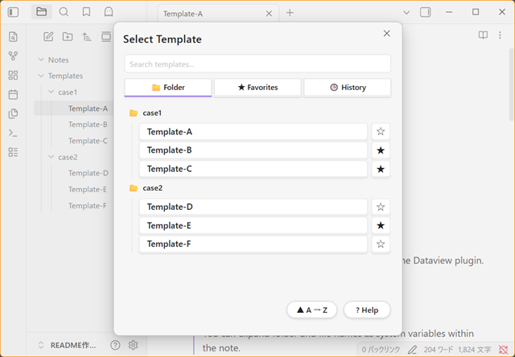
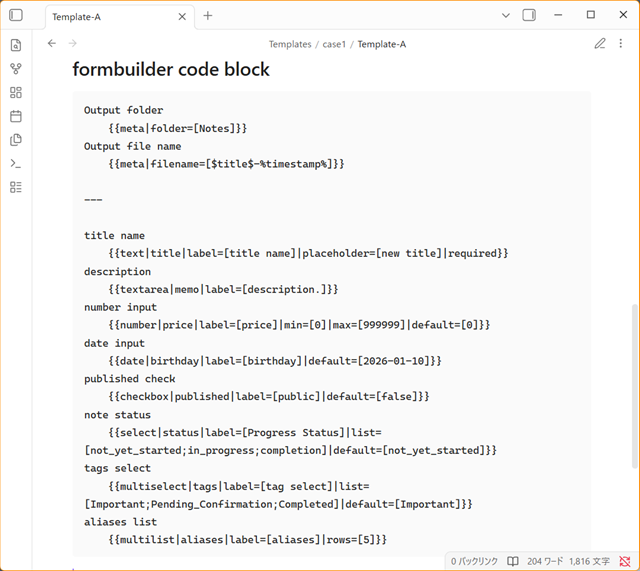
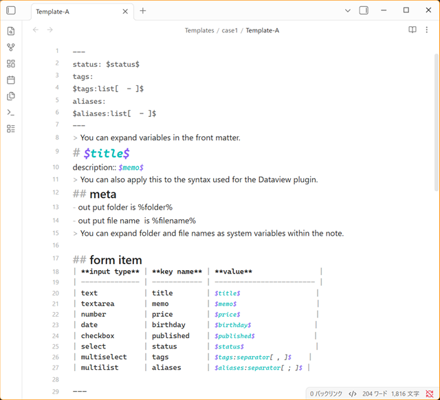
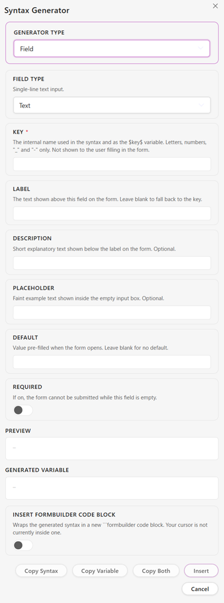
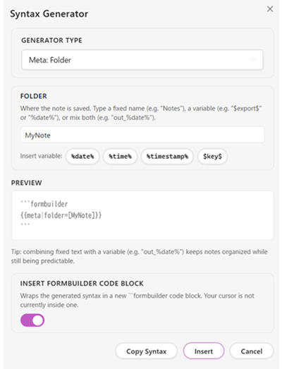
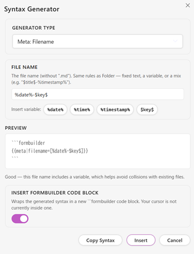

# Form Builder

**Form Builder** is a plugin that lets you build input forms by embedding a simple, custom syntax in your templates, and create new notes with the entered values applied to the template. A built-in **Syntax Generator** can also write that syntax for you, so you don't need to memorize it to get started.

日本語版READMEは [こちら](#日本語説明)

---

## Installation

### Install from Community Plugins (recommended)

1. Open **Settings → Community plugins** in Obsidian.
2. Turn off **Restricted Mode** if it isn't already off.
3. Click **Browse** and search for `Form Builder`.
4. Select **Form Builder** and click **Install**.
5. Once installed, click **Enable**.

### Manual installation

1. Download the latest `main.js`, `manifest.json`, and `styles.css` from [Releases](https://github.com/p77-don/form-builder/releases).
2. Place the three files in the following folder inside your Vault.

```
{vault}/.obsidian/plugins/form-builder/
├── main.js
├── manifest.json
└── styles.css
```

3. Enable **Form Builder** under **Settings → Community plugins**.

---

## Setup

### Setting the template folder

Enter the name of the folder where your template files live under **Settings → Form Builder → Template folder**.

```
Templates
```

The default is `Templates`. Only Markdown files in this folder that contain a `formbuilder` code block are recognized as templates.

### Language setting

**Settings → Form Builder → Language** switches the display language for the entire plugin.

| Option | Description |
|---|---|
| English | English (default) |
| 日本語 | Japanese |

Changing this setting updates the settings screen, forms, Syntax Generator, help, and all notification messages.

---

## Basic Usage

1. Create a Markdown file containing a `formbuilder` code block in your template folder (if you don't want to memorize the syntax, you can assemble it with the [Syntax Generator](#syntax-generator) instead).
2. Open the command palette (`Ctrl` / `Cmd` + `P`) and run **Create Note From Template**.
3. If multiple templates exist, the **Template Picker** opens — browse by folder, jump to a favorite, or reuse something from your history (see [Template Picker](#template-picker)).
4. Fill in the form that appears and click **Create Note**.
5. A new note is created in the folder specified by `meta` and automatically opened.

---

## Template Picker

When more than one template is available, running **Create Note From Template** opens the **Template Picker**.



### Tabs

| Tab | Shows |
|---|---|
| 📁 Folder | Your template folder's subfolder structure, exactly as it is in the Vault. Click a folder to expand (📂) or collapse (📁) it. |
| ★ Favorites | Only the templates you've starred. |
| 🕒 History | The last 20 templates you've used, most recent first. |

The picker remembers which tab you had open last time.

### Search

The search box at the top filters whichever tab is currently open. While searching the Folder tab, results are shown as a flat list (instead of the folder tree) so you can find a template regardless of which subfolder it's in. Once you start typing, a **×** appears — click it to clear the search box.

### Sort

The ▲ / ▼ button next to **? Help** toggles ascending/descending order by name. It applies to the Folder and Favorites tabs; on the History tab it's grayed out, since history is always ordered by most recently used.

### Favorites

Tap ☆ next to any template to add it to Favorites (it becomes ★). Tap ★ again to remove it.

### History

Every template you successfully use is added to the top of History (an existing entry moves up instead of duplicating). **Clear History** — next to the sort button, visible only on this tab — empties the whole list. To avoid accidental data loss, tap it once to arm it (it turns red and reads "tap again to confirm"), then tap again within a few seconds to actually clear it.

### Missing templates

If a favorited or recently-used template file is renamed or moved from *within* Obsidian (e.g. in the file explorer), Form Builder updates the saved reference automatically and you won't notice anything. If it's renamed, moved, or deleted from *outside* Obsidian (e.g. your OS's file explorer) while Obsidian is closed, Form Builder can't track that change. In that case the entry is shown grayed out with a **(missing — tap ✕ to remove)** label instead of silently disappearing, so you can decide for yourself whether to remove it.

Templates found in nested subfolders are labeled with their path relative to your template folder (e.g. `item/case/item-b`) wherever they're shown in a flat list (Favorites, History, or a Folder-tab search), so templates with the same file name in different folders stay distinguishable.

---

## Template Structure

A template file consists of two parts: a **form definition area** and a **body area**.

````markdown
---
(Frontmatter: subject to variable expansion)
---

```formbuilder
(form definition)
```

(Body: subject to variable expansion)
````

### Form definition area

Written only inside a ` ```formbuilder ` code block.
This is where you define fields and output settings (`meta`).
This block is not included in the generated note — it's removed automatically.



#### You can split it across multiple formbuilder code blocks

A single template can contain more than one ` ```formbuilder ` code block. The contents of every block are merged into a single form. You can, for example, keep `meta` and your field definitions in separate blocks.

````markdown
```formbuilder
{{meta|folder=[folder]}}
{{meta|filename=[%timestamp%]}}
```

```formbuilder
{{text|title|label=[title]|required}}
{{textarea|description}}
```
````

When there are multiple blocks, any Markdown between them is treated as ordinary body content in the generated note. All the blocks themselves are stripped out and never appear in the note.

> **Watch out for duplicate keys:** even when split across blocks, you still can't define the same field key (`$key$`) or the same `meta` key (`folder` / `filename`) more than once. Doing so is an error — see [Errors and Warnings](#errors-and-warnings) for details.

### Body area

Everything outside the code block is subject to variable expansion.

- Frontmatter
- Regular text, headings, lists, tables, quotes, HTML

Writing `$key$` in the body replaces it with the form's input value.
For `multiselect` / `multilist` fields, you can control the expanded format with a **variable modifier** — see [Variable Modifiers](#variable-modifiers) for details.

> **The two kinds of brackets:**
> User variables are wrapped in dollar signs `$...$`; system variables are wrapped in percent signs `%...%`.



---

## Syntax Generator

A tool that lets you assemble `{{...}}` syntax, `$key$` variables, and `meta` syntax from a GUI, without having to memorize the custom syntax.

### Opening it

Open the command palette (`Ctrl` / `Cmd` + `P`) and run **Syntax Generator**. A dialog opens.



### Generator Type

A dropdown at the top of the dialog lets you choose what to generate.

| Generator Type | Syntax it generates |
|---|---|
| Field | `{{type\|key\|option=[value]\|...}}` |
| Meta: Folder | `{{meta\|folder=[...]}}` |
| Meta: Filename | `{{meta\|filename=[...]}}` |

### Field mode

The **Field Type** dropdown lets you choose from the 8 field types (`text` / `textarea` / `number` / `date` / `checkbox` / `select` / `multiselect` / `multilist`). The settings shown below it change automatically based on the type you pick.

**Common fields** (shown for every type): `Key`, `Label`, `Description`

**Type-specific fields:**

| Field Type | Fields shown |
|---|---|
| `text` / `date` | Placeholder, Default, Required |
| `textarea` | Placeholder, Default, Rows, Required |
| `number` | Placeholder, Default, Min, Max, Required |
| `checkbox` | Just the Default toggle ("Checked by default"). `Required` is meaningless for a checkbox, so it isn't shown. |
| `select` | Options, Default, Required |
| `multiselect` | Options, Rows, Default, Required |
| `multilist` | Placeholder, Rows, Required (no `Default` — the custom syntax can only be parsed one line at a time, so it can't represent a multi-line default) |

Every field shows a short hint so the meaning of each option is clear even the first time you use it. In particular, the hint for `select`'s `Default` explains it's "the option that's selected initially," and `multiselect`'s explains you can specify several with a `;` separator.

**Preview:** shows the generated syntax (`{{...}}`) in real time as you type. It stays empty if the key is missing or contains invalid characters.

**Generated Variable:** shows how to use `$key$` based on your key.

- Scalar types (`text` / `textarea` / `number` / `date` / `checkbox` / `select`): only `$key$` is shown (the value is substituted as-is).
- Array types (`multiselect` / `multilist`): since `$key$` alone doesn't convey how to use it, all four of the following are shown together.

```
$key$
$key:list[- ]$
$key:list[1. ]$
$key:separator[; ]$
```

### Meta mode (Folder / Filename)

A single text field lets you freely combine fixed text, variables (`$key$`, `%date%`, etc.), or both. Below the field, **Insert variable** buttons (`%date%` `%time%` `%timestamp%` `$key$`) insert that token at the current cursor position.

| Folder | Filename |
|----|----|
|||

**Duplicate-filename warning in Filename mode:** if the value you entered contains no variable (no token with `$` or `%`), a warning is shown: "This file name is entirely fixed text. If a note with the same name already exists in the folder, creating a new note will fail." (In practice note creation won't actually fail, thanks to the [automatic renaming](#metafilename) described below — but the warning still helps you notice an unintended overwrite risk.)

### Insert formbuilder code block

A checkbox labeled **"Insert formbuilder code block"** appears only when the cursor in the active editor is currently **outside** an existing `formbuilder` block.

- **Left unchecked:** only the generated syntax line (`{{...}}` or `{{meta|...}}`) is used for Preview, copying, and inserting, as before. If you click **Insert** while the cursor is outside a block, a "Place the cursor inside a formbuilder code block" notice appears and nothing is inserted.
- **Checked:** the generated syntax is automatically wrapped in ` ```formbuilder ` / ` ``` `, and the Preview reflects that too. You can then **Copy Syntax** to copy it in that wrapped form, or **Insert** to drop a brand-new code block at the cursor position.

### Buttons

| Button | Action |
|---|---|
| Copy Syntax | Copies the generated syntax to the clipboard (wrapped in a code block too, if "Insert formbuilder code block" is on) |
| Copy Variable | Copies the generated variable(s) to the clipboard (Field mode only; array types copy all 4 patterns together) |
| Copy Both | Copies both the syntax and the variable(s) (Field mode only) |
| Insert | Inserts the syntax at the cursor position in the active editor |
| Cancel | Closes the dialog |

If the key is empty or invalid (Field mode), or the value is empty (Meta mode), all of the Insert/Copy buttons are disabled.

---

## FormBuilder Syntax Reference

### Basic Syntax

All syntax is wrapped in `{{` and `}}`.

```
{{type|key}}
{{type|key|option=[value]}}
{{type|key|option=[value]|option2=[value2]}}
```

#### Whitespace handling

Half-width and full-width spaces around `{{`, `}}`, and `|` are ignored.
The following are all treated as identical.

```
{{text|name}}
{{ text | name }}
{{ text | name | required }}
```

#### Allowed characters in a key

```
a-z  A-Z  0-9  _  -
```

The following characters cannot be used in a key: `| { } [ ] $ % space (half-width or full-width)`

Keys are case-sensitive (`name` and `Name` are different keys).

#### Option value syntax

Values must be wrapped in `[]`.

```
label=[Title]
placeholder=[Enter your name]
min=[0]
max=[200]
```

Everything inside `[]` is used as the value verbatim (including spaces).

```
placeholder=[ has a leading space ]
→ the value is " has a leading space "
```

---

### meta Syntax

Describes settings for the note that gets generated. These aren't shown in the form — they're settings referenced when the note is generated.

```
{{meta|key=[value]}}
```

#### meta|folder

Specifies the folder the note is saved to.

**To fix the folder:**

```
{{meta|folder=[Notes]}}
{{meta|folder=[Projects/2026]}}
```

The note is always saved to the specified folder. If it doesn't exist, it's created automatically (nested paths are supported too). If omitted, the note is saved to the Vault root.

**To let the form ask for the destination:**

Use `$key$` in `folder` and define a matching field separately.

```
{{meta|folder=[$export$]}}
{{text|export|label=[Output folder]|default=[Notes]}}
```

An "Output folder" input appears in the form, letting the user specify it at run time. It's recommended to set an initial value with `default=[Notes]`.

#### meta|filename

Specifies the file name of the generated note (the `.md` extension is added automatically).

```
{{meta|filename=[my-note]}}
{{meta|filename=[$title$-%timestamp%]}}
{{meta|filename=[Report_%date%]}}
```

- You can use `$key$` to reference form input values.
- You can use system variables such as `%timestamp%`, `%date%`, and `%time%`.
- System variables are evaluated when the note is saved.
- Characters not allowed in file names (`/ \ : * ? " < > |`) are automatically replaced with `_`.
- Windows reserved device names (`CON`, `NUL`, `COM1`, etc.) are prefixed with `_`. This runs automatically and needs no action on your part — see the note below for when it actually matters.
- If omitted, the file is named `Untitled.md`.

> **About the Windows reserved-name check:** on Windows, a small set of names (`CON`, `PRN`, `AUX`, `NUL`, `COM1`–`COM9`, `LPT1`–`LPT9`) are reserved by the OS itself for device identifiers, so a file with exactly one of those names cannot be created at all — this is a Windows filesystem restriction, not a limitation of Form Builder or Obsidian, and it doesn't affect macOS or Linux. It only matters if a `meta|filename` value (fixed text or a `$key$` value typed by the user) happens to collide with one of these names — for example a template that asks for an equipment or device name. When that happens, Form Builder automatically prefixes the file name with `_` (e.g. `CON` → `_CON.md`) so note creation doesn't silently fail on Windows. You don't need to do anything for this to work.

**If a file with the same name already exists (automatic renaming):** if a file with the same name already exists in the destination folder, the note is saved with a number appended automatically — `note.md` → `note (2).md` → `note (3).md`. When this happens, a notice tells you the actual file name that was used. If the body uses `%filename%`, it reflects the actual, post-renaming file name too.

#### Unknown meta keys

If an undefined key is used, a warning is shown and the key is ignored (form generation continues).

#### Duplicate meta keys are an error

Defining the same `meta` key (`folder` or `filename`) more than once makes it unclear which value actually takes effect and invites mistakes, so it's treated as a **fatal error** that aborts note creation (this is checked across the whole template, even if you've split it across multiple `formbuilder` blocks).

```
{{meta|folder=[folder-a]}}
{{meta|folder=[folder-b]}}
```

If a template like this is selected via `Create Note From Template`, an error is shown immediately and the form doesn't open. See [Errors and Warnings](#errors-and-warnings) for details.

---

### Field Syntax

Defines the input fields shown in the form.

```
{{type|key}}
{{type|key|option=[value]}}
{{type|key|option1=[value1]|option2=[value2]|flag}}
```

**Positional argument order:**

1. `type` (field type) — required
2. `key` (variable name) — required
3. Everything after is an option (order doesn't matter)

#### Duplicate field keys are an error

Using the same key (`$key$` variable name) for more than one field makes it unclear which value actually takes effect and invites mistakes, so it's treated as a **fatal error** that aborts note creation (this is checked even across multiple `formbuilder` blocks).

```formbuilder
{{text|title|label=[title-a]}}
{{text|title|label=[title-b]}}
```

If a template like this is selected via `Create Note From Template`, an error is shown immediately and the form doesn't open. See [Errors and Warnings](#errors-and-warnings) for details.

---

### Field Types

#### `text` — single-line text input

```
{{text|name}}
{{text|name|label=[Name]|placeholder=[Jane Doe]|required}}
```

Displays a single-line text field in the form.

**Available options:** `label` `placeholder` `description` `default` `required`

**Output example:**

```
Template body: Author: $name$
Input value:   Jane Doe
Output:        Author: Jane Doe
```

---

#### `textarea` — multi-line text input

```
{{textarea|description}}
{{textarea|description|label=[Description]|rows=[8]|placeholder=[Write the details...]}}
```

Displays a multi-line text field in the form.

**Available options:** `label` `placeholder` `description` `default` `required` `rows`

**Output example:** The entered text is expanded verbatim (line breaks are preserved).

---

#### `number` — numeric input

```
{{number|price}}
{{number|price|label=[Price]|min=[0]|max=[999999]|default=[0]}}
```

Displays a numeric input field. `min` / `max` can be used to constrain the allowed range.

**Available options:** `label` `placeholder` `description` `default` `required` `min` `max`

**Error condition at template-parse time:** if `min > max`, this is a fatal error and form generation is aborted.

**Error condition at submit time:** if the form contains a value that can't be recognized as a number, or a value outside the `min` / `max` range, when you click **Create Note**, the field is highlighted in red and submission is blocked (no note is created).

**Output example:**

```
Template body: Price: $price$ yen
Input value:   1500
Output:        Price: 1500 yen
```

---

#### `date` — date input

```
{{date|birthday}}
{{date|birthday|label=[Birthday]|default=[2000-01-01]}}
```

Displays a date picker in the form.

**Available options:** `label` `description` `default` `required`

**Output example:**

```
Template body: Date: $birthday$
Input value:   2000-01-01
Output:        Date: 2000-01-01
```

---

#### `checkbox` — toggle (boolean)

```
{{checkbox|published}}
{{checkbox|published|label=[Publish]|default=[true]}}
```

Displays a toggle switch in the form.

**Available options:** `label` `description` `default`

- `default=[true]` turns the toggle on by default
- `required` has no effect on `checkbox` (an "off" state is still a valid value)

**Output example:**

```
Output when on:  true
Output when off: false
```

---

#### `select` — single choice

```
{{select|status|list=[Not started;In progress;Done]}}
{{select|status|label=[Status]|list=[Not started;In progress;Done]|default=[Not started]}}
```

Displays a dropdown list in the form.
The `list` option is required — omitting it is a fatal error.

**Available options:** `label` `description` `default` `required` `list`

**`list` syntax:**

Separate options with a semicolon (`;`). Spaces immediately before or after a semicolon are trimmed automatically; spaces inside an item are preserved.

```
list=[Not started;In progress;Done]
list=[ Not started ; In progress ; Done ]  → same result (surrounding spaces trimmed)
list=[I am a boy;I am a girl]              → two items: "I am a boy", "I am a girl"
```

**A note on `default`:** if the value given in `default` doesn't exist in `list`, a warning is shown and the field starts unselected.

**Output example:**

```
Template body: Status: $status$
Selected value: In progress
Output:         Status: In progress
```

---

#### `multiselect` — multiple choice

```
{{multiselect|tags|list=[Important;Pending;Done]}}
{{multiselect|tags|label=[Tags]|list=[Important;Pending;Done]|default=[Important;Done]}}
```

Displays a checkbox-style multi-select UI in the form.
The `list` option is required — omitting it is a fatal error.

**Available options:** `label` `description` `default` `required` `list` `rows`

**Multiple defaults with `default`:** separate several default values with a semicolon.

```
{{multiselect|tags|list=[Important;Pending;Done]|default=[Important;Done]}}
```

**Controlling the output format:**

The output format isn't set on the field itself — it's set with a **variable modifier** in the body text.
Expanded without a modifier (`$tags$`), the selected values are joined with a plain comma (no space).

```
$tags$               → Important,Done
$tags:separator[: ]$ → Important: Done
$tags:list[- ]$      → - Important\n- Done
```

See [Variable Modifiers](#variable-modifiers) for details.

---

#### `multilist` — free-form list, multi-value input

```
{{multilist|aliases}}
{{multilist|aliases|label=[Aliases]|rows=[5]}}
```

Displays a multi-line text field in the form. **One item per line.** Blank lines are removed automatically when the note is saved.

Unlike `select` or `multiselect`, no predefined options are needed — the user can type any list of values freely. This is a good fit for cases like Frontmatter `aliases`, where you want to register an arbitrary number of free-text strings.

**Available options:** `label` `placeholder` `description` `default` `required` `rows`

> **`default` cannot contain line breaks:** the custom syntax parses a `formbuilder` block one line at a time, so a `default=[...]` value can't contain an actual line break. Because a multi-line default isn't supported, the [Syntax Generator](#syntax-generator) doesn't offer `default` for `multilist`.

**Controlling the output format:**

As with `multiselect`, the output format is set with a **variable modifier** in the body text.
Expanded without a modifier (`$aliases$`), the entered values are output comma-separated (no space).

```
$aliases$               → Tokyo Office,main office,HQ
$aliases:separator[; ]$ → Tokyo Office; main office; HQ
$aliases:list[- ]$      → - Tokyo Office\n- main office\n- HQ
```

See [Variable Modifiers](#variable-modifiers) for details.

---

### Options Reference

| Option | Value format | Applies to | Description |
|---|---|---|---|
| `label=[display name]` | String | All fields | The label shown in the form. Defaults to the key name if omitted |
| `required` | Flag (no value) | All fields (no effect on `checkbox`) | Requires input. Blocks submission and highlights the field if left empty |
| `placeholder=[...]` | String | text / textarea / number / date / multilist | Hint text shown inside the input |
| `description=[...]` | String | All fields | Description text shown below the label |
| `default=[value]` | String | All fields | Initial value shown when the form opens (effectively one line only for `multilist`, since it can't contain a line break) |
| `list=[A;B;C]` | Semicolon-separated string | select / multiselect | The list of options (required for these types) |
| `min=[number]` | Number | number | Minimum allowed value. A value outside the range is an error at submit time |
| `max=[number]` | Number | number | Maximum allowed value. A value outside the range is an error at submit time |
| `rows=[count]` | Integer | textarea / multiselect / multilist | Number of visible rows |

---

### Variables

#### User variables vs. system variables

Form Builder has two kinds of variables, distinguished by **which symbol wraps them**.

| Kind | Syntax | Evaluated |
|---|---|---|
| User variable | `$key$` (dollar sign) | The form's input value |
| System variable | `%name%` (percent sign) | At the moment the note is saved |

#### User variables

Reference the value entered in the form. They can be used in the template body, Frontmatter, and in `meta`'s `filename` / `folder`.

```
$title$
$author$
$status$
```

Keys may only contain `[a-zA-Z0-9_-]` characters. Keys are case-sensitive.

A variable that appears in the body but has no matching field defined (`$undefined_key$`) is output as-is (this is not an error).

**Default expansion for `multiselect` / `multilist`:**

Expanded without a modifier (`$key$`), the selected or entered values are joined with a plain comma (no space).

```
Selected values: Important, Done (2 items)
$tags$ → Important,Done
```

To change the output format, use a [Variable Modifier](#variable-modifiers).

#### System variables

Variables provided by the plugin. All of them are evaluated **when the note is saved**.

| Variable | Description | Example output |
|---|---|---|
| `%timestamp%` | Save time (yyyyMMddHHmmss format) | `20260626153000` |
| `%date%` | Save date | `2026-06-26` |
| `%time%` | Save time | `15:30:00` |
| `%folder%` | The note's final output folder (after `meta\|folder` is resolved) | `Characters` |
| `%filename%` | The note's final file name without the `.md` extension (after `meta\|filename` is resolved, sanitized, and — if it collided with an existing file — renamed) | `Alice-20260624153000` |

> **Note:**
> system variables are evaluated at **the moment you click Create Note**, not when the form was opened.
> `%folder%` and `%filename%` can only be used in the body. Using them inside `meta|folder` or `meta|filename` itself would be self-referential, so they are not expanded there.
> If the file name was renamed automatically because of a collision, `%filename%` reflects the actual, post-renaming name.

#### Variable expansion scope

| Location | User variables | System variables |
|---|---|---|
| Frontmatter | ✅ | ✅ |
| Body (headings, lists, tables, etc.) | ✅ | ✅ |
| `meta\|filename` | ✅ | ✅ |
| `meta\|folder` | ✅ | ✅ |
| Inside the `formbuilder` block | ❌ (treated as the form definition) | ❌ |

#### Mixing user and system variables

```
{{meta|filename=[$title$-%timestamp%]}}
```

If you enter "Meeting Notes" for `$title$` and save:

```
Meeting Notes-20260626153000.md
```

---

### Variable Modifiers

`multiselect` / `multilist` fields hold an array of values. When expanding them in the body, you can specify the output format with a modifier.

#### Basic syntax

```
$key$                        No modifier (joined with a comma only)
$key:separator[separator]$   Joined with the given separator
$key:list[prefix]$           Each item prefixed and joined with line breaks
```

If a modifier is used on a field that isn't `multiselect` / `multilist`, a warning is shown and the modifier is ignored.

> **The brackets `[]` are required:** a form like `$key:list$` with the `[]` omitted is invalid. Always give a prefix string inside `[]` (an empty string is fine), e.g. `$key:list[- ]$`.

#### The `separator` modifier

Uses the string inside `[]` as the separator verbatim, including any spaces.

```
$tags:separator[,]$      → Important,Pending,Done
$tags:separator[, ]$     → Important, Pending, Done
$tags:separator[ / ]$    → Important / Pending / Done
$tags:separator[・]$     → Important・Pending・Done
$tags:separator[ | ]$    → Important | Pending | Done
```

#### The `list` modifier

Uses the string inside `[]` as a prefix for each line, joined with line breaks.

```
$tags:list[- ]$       →   - TypeScript
                          - Python
                          - Go

$tags:list[* ]$       →   * TypeScript
                          * Python

$tags:list[ ・ ]$     →    ・ TypeScript
                           ・ Python
```

**Auto-numbering:** numbers are generated automatically only when the text inside `[]` starts with `1.`.

```
$tags:list[1. ]$      →   1. TypeScript
                          2. Python
                          3. Go

$tags:list[1) ]$      →   1) TypeScript    ← only "1." triggers numbering
                          1) Python
```

**Indented lists (for Frontmatter):**

When expanding into Frontmatter fields like `aliases` or `tags`, you can control the indentation by adding spaces to the prefix string.

Template:

```markdown
---
aliases:
$aliases:list[  - ]$
tags:
$tags:list[  - ]$
---
```

Output, given the input "The_Pragmatic_Programmer / The_Perfect_Programmer" and "technical_book / References":

```yaml
---
aliases:
  - The_Pragmatic_Programmer
  - The_Perfect_Programmer
tags:
  - technical_book
  - References
---
```

The same variable can also be expanded in a different format elsewhere in the body.

```markdown
Aliases: $aliases:separator[、]$
```

```
Aliases: The Pragmatic Programmer、The Perfect Programmer
```

---

## Errors and Warnings

### Fatal errors (aborts note creation at template-selection time)

In the following cases, an error notice is shown as soon as you select the template via `Create Note From Template`, and the form doesn't open (no note is created).

| Condition | Example message |
|---|---|
| Unknown field type | `Unknown field type: "foo"` |
| `select` / `multiselect` missing `list` | `"select" requires the "list" option in field "${key}"` |
| `min > max` | `"min" (10) must not exceed "max" (5) in field "count"` |
| Unmatched `{{` / `}}` | `Unclosed "{{" found on line 3` |
| Key contains disallowed characters | `Invalid key: "$name$". Keys must match [a-zA-Z0-9_-]` |
| The same `meta` key (`folder` / `filename`) is defined more than once | `"meta\|folder" is defined more than once (first defined on line 2). Only one "meta\|folder" is allowed per template.` |
| The same field key is defined more than once | `Key "title" is defined more than once (first defined on line 2). Each field key must be unique within a template.` |

### Warnings (the form still opens)

In the following cases, a warning is shown at the top of the form, but the form remains usable.

| Condition | Behavior |
|---|---|
| Unknown option name (e.g. `requred`) | The option is ignored. A suggestion is shown if a close match is found |
| Undefined meta key | The key is ignored |
| `default` value not present in `list` | `default` is ignored and the field starts unselected |

### Modifier warnings (shown on save)

If a variable modifier is used incorrectly, a Notice is shown when the note is saved (the note is still saved).

| Condition | Behavior |
|---|---|
| `:separator` / `:list` used on a key that isn't `multiselect` / `multilist` | The modifier is ignored and the value is expanded as-is |
| Unknown modifier name (e.g. `:markdownlist`) | The modifier is ignored and values are joined with a comma |

> **Typo suggestions:** for unknown option names, a `Did you mean "..."?` suggestion is shown if the edit distance (Levenshtein distance) to a known option name is 2 or less.

### Submit-time validation (checked when you click Create Note)

Clicking **Create Note** blocks submission and highlights the offending field in red in the following cases. No note is created.

| Condition | Behavior |
|---|---|
| A field marked `required` is left empty | The field is highlighted and submission is blocked |
| A `number` field contains a value that isn't recognized as a number | The field is highlighted and submission is blocked |
| A `number` field's value is outside the `min` / `max` range | The field is highlighted and submission is blocked |

### If the file name collides (not an error)

If a `.md` file with the same name already exists in the destination folder, this is **not** treated as an error — the note is saved with a number appended automatically, e.g. `note (2).md`. When this happens, a notice tells you the actual file name that was used. See [meta|filename](#metafilename) for details.

---

## Template Examples

### 1. A simple note

````markdown
```formbuilder
{{meta|folder=[Notes]}}
{{meta|filename=[$title$-%date%]}}

{{text|title|label=[Title]|required}}
{{select|category|label=[Category]|list=[Work;Personal;Study;Other]}}
{{textarea|body|label=[Content]|rows=[8]}}
```

# $title$

Category: $category$

$body$
````

---

### 2. A reading log (Frontmatter + modifiers)

````markdown
---
title: "$book_title$"
created: "%date%"
tags:
$tags:list[  - ]$
aliases:
$aliases:list[  - ]$
---

```formbuilder
{{meta|folder=[Books]}}
{{meta|filename=[$book_title$-%timestamp%]}}

{{text|book_title|label=[Title]|required}}
{{text|author|label=[Author]}}
{{text|publisher|label=[Publisher]}}
{{date|read_date|label=[Date finished]}}
{{select|status|label=[Status]|list=[Want to read;Reading;Finished;Paused]|default=[Want to read]}}
{{select|rating|label=[Rating]|list=[★★★★★;★★★★;★★★;★★;★]}}
{{textarea|summary|label=[Summary]|rows=[4]}}
{{textarea|memo|label=[Notes / thoughts]|rows=[6]}}
{{multiselect|tags|label=[Tags]|list=[Technical;Business;Fiction;Practical;Reference;Reread candidate]}}
{{multilist|aliases|label=[Alternate / original titles]}}
{{checkbox|recommended|label=[Recommended]}}
```

# $book_title$

**Author:** $author$　**Publisher:** $publisher$　**Finished:** $read_date$

**Status:** $status$　**Rating:** $rating$

## Summary

$summary$

## Notes / thoughts

$memo$

**Tags:** $tags:separator[, ]$
````

Frontmatter output example (given `aliases` = "The Pragmatic Programmer / 達人プログラマー" and `tags` = "Technical / Reference"):

```yaml
---
title: "達人プログラマー"
created: "2026-06-26"
tags:
  - Technical
  - Reference
aliases:
  - The Pragmatic Programmer
  - 達人プログラマー
---
```

The same variable can also be expanded in a different format elsewhere in the body.

```markdown
**Tags:** $tags:separator[, ]$
```

```
Tags: Technical, Reference
```

---

### 3. Meeting minutes (auto-generated file name using a system variable, meta and fields split across blocks)

````markdown
---
date: "%date%"
---

```formbuilder
{{meta|folder=[Meetings]}}
{{meta|filename=[Meeting_%date%]}}
```

```formbuilder
{{text|project|label=[Project name]|required}}
{{date|meeting_date|label=[Meeting date]}}
{{multilist|attendees|label=[Attendees]}}
{{textarea|agenda|label=[Agenda]|rows=[4]}}
{{textarea|notes|label=[Minutes]|rows=[10]}}
{{textarea|action|label=[Action items]|rows=[4]}}
```

# $project$ — Meeting Minutes

**Date:** $meeting_date$
**Attendees:** $attendees:separator[, ]$

## Agenda

$agenda$

## Minutes

$notes$

## Action Items

$action$
````

The `meta` settings and the field definitions are written in separate blocks here, but they're still merged correctly into a single form.

---

## FAQ

### Q. A template doesn't show up in the list

Check that the file contains a `formbuilder` code block — a plain Markdown file without one won't appear in the list. Also double-check that **Template folder** in Settings points to the correct folder.

### Q. `$key$` isn't replaced and shows up as-is

Check that a field with the matching `key` is defined in the form. Keys are case-sensitive (`Title` and `title` are different keys).

### Q. A Frontmatter YAML list isn't expanding correctly

To output an indented YAML list from `multiselect` / `multilist`, use a variable modifier.

```markdown
tags:
$tags:list[  - ]$
```

The number of leading spaces inside `[]` becomes the indentation width. To match Obsidian's standard 2-space indentation, write `list[  - ]` (two spaces).

### Q. I want to use a `multiselect` value in a different format in the body vs. in Frontmatter

You can expand the same variable multiple times with different modifiers.

```markdown
---
tags:
$tags:list[  - ]$
---

In the body: $tags:separator[, ]$
```

### Q. What's the difference between `multiselect` and `multilist`?

| | `multiselect` | `multilist` |
|---|---|---|
| Options | Must be predefined in the template | Free text |
| UI | Checkboxes | Text area (one item per line) |
| Use case | Choosing several from a fixed set | Registering an arbitrary number of free-text strings |

Both use a modifier (`:separator` / `:list`) to control the output format.

### Q. What happens if I enter a character that isn't allowed in a file name?

Characters prohibited by the OS (`/ \ : * ? " < > |`) are automatically replaced with `_`, and a notice is shown. Windows reserved device names (`CON`, `NUL`, `COM1`, etc.) are prefixed with `_`.

### Q. What happens if a note with the same name already exists?

It's not an error. If `note.md` already exists, the note is saved with an automatic number appended, like `note (2).md` or `note (3).md`. A notice tells you when this happens.

### Q. What happens if I write `meta|folder` or `meta|filename` more than once?

It's an error, and no note is created. In earlier versions, whichever one was written last silently took effect (an overwrite you might not notice) — it's now detected as a fatal error at template-selection time instead, so you don't end up saving to the wrong place without realizing it.

### Q. What happens if I use the same field key more than once?

It's an error, and no note is created, for the same reason as duplicate `meta` keys.

### Q. Can I specify a nested folder in `meta|folder`?

Yes — use `/` as a separator, e.g. `Projects/2026/Notes`. Any missing folders in the path are created automatically.

### Q. Can I split a `formbuilder` code block into several blocks?

Yes. A single template can contain multiple `formbuilder` code blocks, and the contents of all of them are merged into one form. However, if a `meta` key or a field key is duplicated across the blocks, it's an error.

### Q. Can I build a template without memorizing the syntax?

Yes — open the [Syntax Generator](#syntax-generator) (command palette → **Syntax Generator**) to assemble `{{...}}` syntax, `$key$` variables, and `meta` syntax from a GUI, then copy it to the clipboard or insert it directly into the editor.

---

## License

MIT

---
---

# 日本語説明


**Form Builder**は、テンプレートにシンプルな独自構文を組み込むことで入力フォームを構築し、テンプレートに入力値を反映させた新しいノートを作成するプラグインです。また**構文ジェネレーター**で構文を作成することができるため、構文を覚えなくても使うことができます。

---

## インストール

### コミュニティプラグインからインストール（推奨）

1. Obsidian の **設定 → コミュニティプラグイン** を開く。
2. **「制限モードをオフにする」** をオフにしていない場合は、オフにする。
3. **「閲覧」** をクリックし、検索欄に `Form Builder` と入力する。
4. **Form Builder** を選択し **「インストール」** をクリックする。
5. インストール完了後、**「有効化」** をクリックする。

### 手動インストール

1. [Releases](https://github.com/p77-don/form-builder/releases) から最新バージョンの `main.js`・`manifest.json`・`styles.css` をダウンロードする。
2. Vault 内の以下のフォルダに3ファイルを配置する。

```
{vault}/.obsidian/plugins/form-builder/
├── main.js
├── manifest.json
└── styles.css
```

3. Obsidian の **設定 → コミュニティプラグイン** で **Form Builder** を有効化する。

---

## セットアップ

### テンプレートフォルダの設定

**設定 → Form Builder → Template folder** にテンプレートファイルを置くフォルダ名を入力します。

```
Templates
```

デフォルトは `Templates` です。このフォルダ内に配置された Markdown ファイルのうち、`formbuilder` コードブロックを含むものだけがテンプレートとして認識されます。

### 言語の設定

**設定 → Form Builder → Language** でプラグイン全体の表示言語を切り替えられます。

| 選択肢 | 説明 |
|---|---|
| English | 英語（デフォルト） |
| 日本語 | 日本語 |

設定を変更すると設定画面・フォーム・構文ジェネレーター・ヘルプ・すべての通知メッセージが切り替わります。

---

## 基本的な使い方

1. テンプレートファイル格納フォルダに `formbuilder` コードブロックを含む Markdown ファイルを作成する（構文を覚えていなくても [構文ジェネレーター](#構文ジェネレーターsyntax-generator) で組み立てることができます）。
2. コマンドパレット（`Ctrl` / `Cmd` + `P`）を開き、**Create Note From Template** を実行する。
3. テンプレートが複数ある場合は **テンプレート選択画面** が開く。フォルダから探す、お気に入りから開く、使用履歴から選ぶといった方法が使える（詳しくは[テンプレート選択画面](#テンプレート選択画面)を参照）。
4. 表示されたフォームに入力し、**Create Note** を押す。
5. `meta` で指定したフォルダに新しいノートが生成され、自動的に開く。

---

## テンプレート選択画面

テンプレートが複数ある場合、**Create Note From Template** を実行すると、**テンプレート選択画面** が開きます。


### タブ

| タブ | 表示内容 |
|---|---|
| 📁 フォルダ | テンプレートファイル格納フォルダ以下のサブフォルダ構造をそのまま表示します。フォルダをクリックすると開閉できます（📂 = 開いている / 📁 = 閉じている）。 |
| ★ お気に入り | お気に入り登録したテンプレートのみを表示します。 |
| 🕒 使用履歴 | 直近で使用したテンプレートを最大20件、新しい順に表示します。 |

前回開いていたタブは自動的に記憶され、次回もそのタブが開きます。

### 検索

上部の検索ボックスは、現在開いているタブに対して絞り込みを行います。フォルダタブで検索すると、階層は無視されフラットな一覧として表示されるため、どのサブフォルダにあるテンプレートでも見つけられます。文字を入力すると **×** が現れ、クリックすると検索文字列だけをクリアできます。

### 並び替え

**？ヘルプ** ボタンの左隣にある ▲ / ▼ ボタンで、名前順の昇順・降順を切り替えられます。フォルダタブ・お気に入りタブに適用され、使用履歴タブでは常に使用順（新しい順）で表示されるため、ボタンはグレーアウトして押せなくなります。

### お気に入り

各テンプレートの ☆ をタップするとお気に入りに追加され（★ に変わります）、もう一度タップすると解除されます。

### 使用履歴

テンプレートを使ってノートを生成するたびに、そのテンプレートは履歴の先頭に追加されます（すでに履歴にある場合は重複せず先頭へ移動します）。並び替えボタンの隣、使用履歴タブでのみ表示される **使用履歴をクリア** ボタンで、履歴を一括削除できます。誤操作を防ぐため、1回タップすると赤く変わり「もう一度タップで削除」という確認表示になり、数秒以内にもう一度タップした場合のみ実際に削除されます。

### 見つからないテンプレートについて

お気に入り・使用履歴に登録したテンプレートファイルが **Obsidian 内の操作**（ファイルエクスプローラーでのリネーム・移動）によって移動した場合、Form Builder は参照先を自動的に追従するため、特に何も気にする必要はありません。一方、**Obsidian を閉じている間に PC のエクスプローラーなどでリネーム・移動・削除**された場合は、この追従ができません。その場合、該当テンプレートは黙って一覧から消えるのではなく、グレーアウトした状態で **（見つかりません — ✕ で削除できます）** と表示されます。実際に削除するかどうかはユーザー自身の判断に委ねられます。

サブフォルダ内のテンプレートは、お気に入り・使用履歴・フォルダタブでの検索結果など、フラットな一覧で表示される際にテンプレートフォルダを基準とした相対パス（例:`item/case/item-b`）で表示されるため、別フォルダに同名のテンプレートがあっても区別できます。

---

## テンプレートの構造

テンプレートファイルは **フォーム定義領域** と **本文領域** の 2 つで構成されます。

````markdown
---
（Frontmatter：変数展開の対象）
---

```formbuilder
（フォーム定義）
```

（本文：変数展開の対象）
````

### フォーム定義領域

` ```formbuilder ` コードブロック内にのみ記述します。
フィールドの定義と出力先の設定（meta）を記述します。
このブロックは生成されたノートには含まれません（自動削除されます）。


#### 複数の formbuilder コードブロックに分けて書くこともできる

1つのテンプレート内に ` ```formbuilder ` コードブロックを複数配置できます。すべてのブロックの内容が1つのフォームとして統合されます。`meta` と各フィールドの定義を別々のブロックに分けて記述することも可能です。

````markdown
```formbuilder
{{meta|folder=[folder]}}
{{meta|filename=[%timestamp%]}}
```

```formbuilder
{{text|title|label=[title]|required}}
{{textarea|description}}
```
````

ブロックが複数あっても、ブロックとブロックの間にある本文（Markdown）はそのまま生成されるノートの本文として扱われます。ブロックはすべて自動的に取り除かれ、生成されたノートには含まれません。

> **キーと meta キーの重複に注意：** ブロックを分けて記述していても、同じフィールドキー（`$key$`）や同じ `meta` キー（`folder` / `filename`）を複数回定義することはできません。重複がある場合はエラーになります。詳しくは[エラーと警告](#エラーと警告)を参照してください。

### 本文領域

コードブロック外のすべての領域が変数展開の対象になります。

- Frontmatter
- 通常テキスト・見出し・リスト・テーブル・引用・HTML

本文中に `$キー名$` と書くと、フォームの入力値に置き換わります。
`multiselect` / `multilist` フィールドは、**変数モディファイア**で展開形式を指定できます。詳しくは[変数モディファイア](#変数モディファイア)を参照してください。

> **変数の囲みの違い：**
> ユーザー変数はドル記号 `$...$` で、システム変数はパーセント記号 `%...%` で囲みます。


---

## 構文ジェネレーター（Syntax Generator）

独自構文を覚えていなくても、GUI から `{{...}}` 構文や `$キー名$` 変数、`meta` 構文を組み立てられる機能です。

### 起動方法

コマンドパレット（`Ctrl` / `Cmd` + `P`）を開き、**Syntax Generator** を実行します。ダイアログが表示されます。


### Generator Type（生成する内容の切り替え）

ダイアログ上部のドロップダウンで、生成する内容を3種類から選べます。

| Generator Type | 生成される構文 |
|---|---|
| フィールド | `{{type\|key\|option=[value]\|...}}` |
| Meta: フォルダ | `{{meta\|folder=[...]}}` |
| Meta: ファイル名 | `{{meta\|filename=[...]}}` |

### フィールドモード

**Field Type** ドロップダウンで8種類のフィールドタイプ（`text` / `textarea` / `number` / `date` / `checkbox` / `select` / `multiselect` / `multilist`）から選べます。選んだタイプに応じて、下に表示される設定項目が自動的に切り替わります。

**共通項目**（すべてのタイプで表示）：`キー`・`ラベル`・`説明`

**タイプ別の項目：**

| Field Type | 表示される項目 |
|---|---|
| `text` / `date` | プレースホルダー・デフォルト値・必須項目にする |
| `textarea` | プレースホルダー・デフォルト値・行数・必須項目にする |
| `number` | プレースホルダー・デフォルト値・最小値・最大値・必須項目にする |
| `checkbox` | デフォルト値（初期状態でONにする、のトグルのみ。`required` は checkbox には意味を持たないため表示されません） |
| `select` | 選択肢・デフォルト値・必須項目にする |
| `multiselect` | 選択肢・行数・デフォルト値・必須項目にする |
| `multilist` | プレースホルダー・行数・必須項目にする（`default` は独自構文が1行単位でしか扱えず複数行を表現できないため提供していません） |

すべての項目にヒント文が表示されるため、初めて使う場合でもオプションの意味が分かるようになっています。特に `select` の `default` は「選択されている値」、`multiselect` の `default` は「`;` 区切りで複数指定できる」ことをヒントで明示しています。

**Preview：** 入力するたびに、生成される構文（`{{...}}`）をリアルタイムに表示します。キーが未入力・不正な文字を含む場合は生成されません。

**展開用変数：** キーを基にした `$キー名$` の使い方を表示します。

- スカラー型（`text` / `textarea` / `number` / `date` / `checkbox` / `select`）: `$キー名$` のみ表示（入力値がそのまま置き換わります）
- 配列型（`multiselect` / `multilist`）: `$キー名$` 単体では使い方が分かりにくいため、以下の4パターンをまとめて表示します。

```
$キー名$
$キー名:list[- ]$
$キー名:list[1. ]$
$キー名:separator[; ]$
```

### Meta モード（フォルダ / ファイル名）

1つのテキスト入力欄に、固定文字列・変数（`$キー名$` や `%date%` など）・その組み合わせを自由に入力できます。入力欄の下にある **変数を挿入** ボタン（`%date%` `%time%` `%timestamp%` `$key$`）をクリックすると、カーソル位置にそのトークンを挿入できます。

| フォルダ | ファイル |
|----|----|
|||


**ファイル名モードの重複警告：** 入力した値に変数（`$` または `%` を含むトークン）が1つも含まれていない場合、「このファイル名は完全に固定文字だけになっています。同じフォルダに同名のファイルが既に存在する場合、ノートの作成に失敗します」という警告が表示されます（※実際には後述の[自動リネーム機能](#metafilename)により作成自体は失敗しませんが、意図しない上書きに気づけるよう警告しています）。

### formbuilder コードブロックを挿入する

現在アクティブなエディタのカーソル位置が、既存の `formbuilder` コードブロックの**外側**にある場合のみ、「formbuilder コードブロックを挿入する」というチェックボックスが表示されます。

- **チェックを入れない場合：** 従来通り、生成される構文の行（`{{...}}` や `{{meta|...}}`）のみが Preview・コピー・挿入の対象になります。カーソルがブロック外にある状態で **Insert** を押すと、「formbuilder コードブロックの中にカーソルを置いてください」という通知が表示され、挿入は行われません。
- **チェックを入れた場合：** 生成される構文が ` ```formbuilder ` 〜 ` ``` ` で自動的に囲まれた状態になり、Preview にもその状態で表示されます。この状態のまま **Copy Syntax** でコピーしたり、**Insert** でカーソル位置に新しいコードブロックごと挿入したりできます。

### ボタン

| ボタン | 動作 |
|---|---|
| Copy Syntax | 生成された構文をクリップボードにコピー（「formbuilder コードブロックを挿入する」がONの場合はブロックごとコピー） |
| Copy Variable | 展開用変数をクリップボードにコピー（フィールドモードのみ表示。配列型は4パターンすべてをまとめてコピー） |
| Copy Both | 構文と展開用変数の両方をコピー（フィールドモードのみ表示） |
| Insert | アクティブなエディタのカーソル位置に構文を挿入 |
| Cancel | ダイアログを閉じる |

キーが未入力・不正な場合（フィールドモード）や、値が未入力の場合（Metaモード）は、Insert・Copy 系のボタンはすべて無効化されます。

---

## FormBuilder 構文リファレンス

### 基本書式

すべての構文は `{{` と `}}` で囲みます。

```
{{type|key}}
{{type|key|option=[value]}}
{{type|key|option=[value]|option2=[value2]}}
```

#### スペースの扱い

`{{`・`}}`・`|` の前後に記述した半角・全角スペースは無視されます。
以下はすべて同一として扱われます。

```
{{text|name}}
{{ text | name }}
{{ text | name | required }}
```

#### キー（key）の使用可能文字

```
a-z  A-Z  0-9  _  -
```

以下の文字はキーに使用できません：`| { } [ ] $ % スペース（半角・全角）`

大文字・小文字は区別されます（`name` と `Name` は別のキーです）。

#### オプション値の書式

値は必ず `[]` で囲みます。

```
label=[タイトル]
placeholder=[名前を入力してください]
min=[0]
max=[200]
```

`[]` 内の文字はすべてそのまま値として使用されます（スペースを含む）。

```
placeholder=[ 先頭にスペースがある ]
→ 値は「 先頭にスペースがある 」
```

---

### meta 構文

生成されるノートの設定を記述します。フォームには表示されず、ノート生成時に参照される設定値です。

```
{{meta|key=[value]}}
```

#### meta|folder

ノートの保存先フォルダを指定します。

**フォルダを固定する場合：**

```
{{meta|folder=[Notes]}}
{{meta|folder=[Projects/2026]}}
```

指定したフォルダに常に保存されます。存在しない場合は自動的にフォルダが作成されます（多階層も対応）。省略した場合は Vault のルートに保存されます。

**フォームで保存先を入力させる場合：**

`folder` に `$キー名$` を使い、対応するフィールドを別途定義します。

```
{{meta|folder=[$export$]}}
{{text|export|label=[出力先フォルダ]|default=[Notes]}}
```

フォームに「出力先フォルダ」の入力欄が表示され、ユーザーが実行時に指定できます。`default=[Notes]` で初期値を設定しておくことを推奨します。

#### meta|filename

生成するノートのファイル名を指定します（拡張子 `.md` は自動付与されます）。

```
{{meta|filename=[my-note]}}
{{meta|filename=[$title$-%timestamp%]}}
{{meta|filename=[Report_%date%]}}
```

- `$キー名$` でフォーム入力値を使用できます。
- `%timestamp%`・`%date%`・`%time%` などのシステム変数を使用できます。
- システム変数はノート保存時に評価されます。
- ファイル名に使えない文字（`/ \ : * ? " < > |`）は自動的に `_` に置き換えられます。
- Windows の予約デバイス名（`CON`・`NUL`・`COM1` 等）は先頭に `_` が付与されます
- 省略した場合は `Untitled.md` になります。

**同名ファイルが既に存在する場合（自動リネーム）：** 保存先フォルダに同名のファイルが既に存在する場合、`note.md` → `note (2).md` → `note (3).md` のように自動的に連番を付与して保存します。連番が付与された場合は、実際に保存されたファイル名を知らせる通知が表示されます。本文中で `%filename%` を使っている場合も、連番付与後の実際のファイル名が反映されます。

#### 不明な meta キー

定義されていないキーを記述した場合、警告を表示してそのキーを無視します（フォーム生成は継続します）。

#### meta キーの重複はエラーになる

同じ `meta` キー（`folder` または `filename`）を複数回定義すると、どちらの値が使われるか分かりにくく事故につながるため、**致命的エラー**としてノートの作成を中止します（1つのテンプレート内で複数の `formbuilder` ブロックに分けて書いている場合も、テンプレート全体を通してチェックされます）。

```
{{meta|folder=[folder-a]}}
{{meta|folder=[folder-b]}}
```

上記のように記述した場合、`Create Note From Template` でこのテンプレートを選択した時点でエラーが表示され、フォームは開きません。詳しくは[エラーと警告](#エラーと警告)を参照してください。

---

### フィールド構文

フォームに表示される入力フィールドを定義します。

```
{{type|key}}
{{type|key|option=[value]}}
{{type|key|option1=[value1]|option2=[value2]|flag}}
```

**位置引数の順序：**

1. `type`（フィールドタイプ）— 必須
2. `key`（変数名）— 必須
3. 以降はオプション（順序不問）

#### フィールドキーの重複はエラーになる

同じキー（`$key$` 変数名）を複数のフィールドで使うと、どちらの値が使われるか分かりにくく事故につながるため、**致命的エラー**としてノートの作成を中止します（複数の `formbuilder` ブロックをまたいでいてもチェックされます）。

```formbuilder
{{text|title|label=[title-a]}}
{{text|title|label=[title-b]}}
```

上記のように記述した場合、`Create Note From Template` でこのテンプレートを選択した時点でエラーが表示され、フォームは開きません。詳しくは[エラーと警告](#エラーと警告)を参照してください。

---

### フィールドタイプ一覧

#### `text` — 1行テキスト入力

```
{{text|name}}
{{text|name|label=[名前]|placeholder=[山田 太郎]|required}}
```

フォーム上に1行のテキスト入力欄を表示します。

**使用可能なオプション：** `label` `placeholder` `description` `default` `required`

**出力例：**

```
テンプレート本文: 著者: $name$
入力値: 山田 太郎
出力:   著者: 山田 太郎
```

---

#### `textarea` — 複数行テキスト入力

```
{{textarea|description}}
{{textarea|description|label=[説明]|rows=[8]|placeholder=[詳細を記述...]}}
```

フォーム上に複数行のテキスト入力欄を表示します。

**使用可能なオプション：** `label` `placeholder` `description` `default` `required` `rows`

**出力例：** 入力した内容がそのまま展開されます（改行も保持されます）。

---

#### `number` — 数値入力

```
{{number|price}}
{{number|price|label=[価格]|min=[0]|max=[999999]|default=[0]}}
```

フォーム上に数値入力欄を表示します。`min` / `max` を指定すると入力範囲を制限できます。

**使用可能なオプション：** `label` `placeholder` `description` `default` `required` `min` `max`

**テンプレート解析時のエラー条件：** `min > max` の場合、致命的エラーとしてフォーム生成を中止します。

**送信時のエラー条件：** フォームに数値として認識できない値、または `min` / `max` の範囲外の値が入力された状態で **Create Note** を押すと、該当欄が赤くハイライトされ、送信がブロックされます（ノートは作成されません）。

**出力例：**

```
テンプレート本文: 価格: $price$ 円
入力値: 1500
出力:   価格: 1500 円
```

---

#### `date` — 日付入力

```
{{date|birthday}}
{{date|birthday|label=[誕生日]|default=[2000-01-01]}}
```

フォーム上に日付ピッカーを表示します。

**使用可能なオプション：** `label` `description` `default` `required`

**出力例：**

```
テンプレート本文: 日付: $birthday$
入力値: 2000-01-01
出力:   日付: 2000-01-01
```

---

#### `checkbox` — トグル（真偽値）

```
{{checkbox|published}}
{{checkbox|published|label=[公開する]|default=[true]}}
```

フォーム上にトグルスイッチを表示します。

**使用可能なオプション：** `label` `description` `default`

- `default=[true]` でデフォルトをオン（有効）にできます
- `required` は `checkbox` には効果がありません（オフ状態も有効な値であるため）

**出力例：**

```
オン時の出力:  true
オフ時の出力:  false
```

---

#### `select` — 単一選択

```
{{select|status|list=[未着手;進行中;完了]}}
{{select|status|label=[ステータス]|list=[未着手;進行中;完了]|default=[未着手]}}
```

フォーム上にドロップダウンリストを表示します。
`list` オプションは必須です。省略すると致命的エラーになります。

**使用可能なオプション：** `label` `description` `default` `required` `list`

**`list` の書式：**

選択肢をセミコロン（`;`）で区切ります。セミコロンの直前・直後のスペースは自動的に除去されます。項目内部のスペースはそのまま保持されます。

```
list=[未着手;進行中;完了]
list=[ 未着手 ; 進行中 ; 完了 ]     → 同じ結果（前後のスペースを除去）
list=[I am a boy;I am a girl]       → 「I am a boy」「I am a girl」の2項目
```

**`default` の注意：** `default` に指定した値が `list` に存在しない場合、警告を表示して空選択状態にします。

**出力例：**

```
テンプレート本文: ステータス: $status$
選択値: 進行中
出力:   ステータス: 進行中
```

---

#### `multiselect` — 複数選択

```
{{multiselect|tags|list=[重要;確認待ち;完了]}}
{{multiselect|tags|label=[タグ]|list=[重要;確認待ち;完了]|default=[重要;完了]}}
```

フォーム上にチェックボックス形式の複数選択 UI を表示します。
`list` オプションは必須です。省略すると致命的エラーになります。

**使用可能なオプション：** `label` `description` `default` `required` `list` `rows`

**`default` で複数選択：** セミコロン区切りで複数のデフォルト値を指定できます。

```
{{multiselect|tags|list=[重要;確認待ち;完了]|default=[重要;完了]}}
```

**出力形式の制御：**

出力形式はフィールド定義ではなく、本文中の**変数モディファイア**で指定します。
モディファイアを省略した場合（`$tags$`）、選択値はカンマのみで結合されます（スペースなし）。

```
$tags$               → 重要,完了
$tags:separator[: ]$ → 重要: 完了
$tags:list[- ]$      → - 重要\n- 完了
```

詳しくは[変数モディファイア](#変数モディファイア)を参照してください。

---

#### `multilist` — 自由記述リスト・複数値入力

```
{{multilist|aliases}}
{{multilist|aliases|label=[エイリアス]|rows=[5]}}
```

フォーム上に複数行テキスト入力欄を表示します。**1行に1項目**を入力します。空行は保存時に自動的に除去されます。

`select` や `multiselect` と異なり、選択肢を事前に定義せず、ユーザーが自由にリストを入力できます。Frontmatter の `aliases` のように任意の文字列を複数登録したい場合に適しています。

**使用可能なオプション：** `label` `placeholder` `description` `default` `required` `rows`

> **`default` に改行は含められません：** 独自構文は `formbuilder` ブロックを1行ずつ解析するため、`default=[...]` の値に実際の改行を含めることはできません。複数行の初期値を設定したい場合には対応していないため、[構文ジェネレーター](#構文ジェネレーターsyntax-generator)では `multilist` に `default` を提供していません。

**出力形式の制御：**

`multiselect` と同様に、出力形式は本文中の**変数モディファイア**で指定します。
モディファイアを省略した場合（`$aliases$`）、入力値はカンマ区切りで出力されます（スペースなし）。

```
$aliases$               → 東京オフィス,Tokyo Office,本社
$aliases:separator[; ]$ → 東京オフィス; Tokyo Office; 本社
$aliases:list[- ]$      → - 東京オフィス\n- Tokyo Office\n- 本社
```

詳しくは[変数モディファイア](#変数モディファイア)を参照してください。

---

### オプション一覧

| オプション | 値の形式 | 適用フィールド | 説明 |
|---|---|---|---|
| `label=[表示名]` | 文字列 | 全フィールド | フォーム上のラベル。省略時はキー名をそのまま使用 |
| `required` | フラグ（値なし） | 全フィールド（`checkbox` は指定しても効果なし） | 必須入力。未入力での送信をブロックし、フィールドをハイライト |
| `placeholder=[...]` | 文字列 | text / textarea / number / date / multilist | 入力欄に表示するヒントテキスト |
| `description=[...]` | 文字列 | 全フィールド | ラベルの下に表示する説明文 |
| `default=[値]` | 文字列 | 全フィールド | フォーム表示時の初期値（`multilist` は改行を含められないため実質的に1行のみ） |
| `list=[A;B;C]` | セミコロン区切り文字列 | select / multiselect | 選択肢の一覧（これらのタイプでは必須） |
| `min=[数値]` | 数値 | number | 入力可能な最小値。送信時に範囲外の値はエラーになる |
| `max=[数値]` | 数値 | number | 入力可能な最大値。送信時に範囲外の値はエラーになる |
| `rows=[行数]` | 整数 | textarea / multiselect / multilist | 表示行数 |

---

### 変数

#### ユーザー変数とシステム変数の違い

Form Builder には2種類の変数があり、**囲む記号が異なります**。

| 種別 | 書式 | タイミング |
|---|---|---|
| ユーザー変数 | `$キー名$`（ドル記号） | フォームの入力値 |
| システム変数 | `%変数名%`（パーセント記号） | ノート保存時に評価 |

#### ユーザー変数

フォームへの入力値を参照します。テンプレート本文・Frontmatter・meta の `filename` / `folder` にも記述できます。

```
$title$
$author$
$status$
```

キー名は `[a-zA-Z0-9_-]` の文字のみ使用できます。大文字・小文字は区別されます。

本文中に存在するが対応するフィールドが定義されていない変数（`$undefined_key$`）は、そのまま出力されます（エラーにはなりません）。

**`multiselect` / `multilist` のデフォルト展開：**

モディファイアなしで展開した場合（`$key$`）、選択・入力された値をカンマのみで結合します（スペースなし）。

```
選択値: 重要, 完了（2項目）
$tags$ → 重要,完了
```

出力形式を変えたい場合は[変数モディファイア](#変数モディファイア)を使用してください。

#### システム変数

プラグインが提供する変数です。すべて**ノート保存時**に評価されます。

| 変数 | 説明 | 出力例 |
|---|---|---|
| `%timestamp%` | 保存時刻（yyyyMMddHHmmss 形式） | `20260626153000` |
| `%date%` | 保存日付 | `2026-06-26` |
| `%time%` | 保存時刻 | `15:30:00` |
| `%folder%` | ノートの最終的な出力フォルダ（`meta\|folder` 展開後の値） | `Characters` |
| `%filename%` | ノートの最終的なファイル名（拡張子 `.md` を除く。`meta\|filename` 展開・サニタイズ・重複時の連番付与後の値） | `アリス-20260624153000` |

> **注意：**
> システム変数はフォームを開いた時刻ではなく、**Create Note ボタンを押した瞬間**の時刻で評価されます。
> `%folder%` と `%filename%` は本文でのみ使用できます。`meta|folder` や `meta|filename` 自身の中で使うと自己参照になってしまうため、そこでは展開されません。
> 同名ファイルの重複により連番が付与された場合、`%filename%` には連番付与後の実際のファイル名が反映されます。

#### 変数の展開スコープ

| 場所 | ユーザー変数 | システム変数 |
|---|---|---|
| Frontmatter | ✅ | ✅ |
| 本文（見出し・リスト・テーブル等） | ✅ | ✅ |
| `meta\|filename` | ✅ | ✅ |
| `meta\|folder` | ✅ | ✅ |
| `formbuilder` ブロック内 | ❌（フォーム定義として処理） | ❌ |

#### 変数とシステム変数の混在例

```
{{meta|filename=[$title$-%timestamp%]}}
```

`$title$` に「Meeting Notes」を入力して保存した場合：

```
Meeting Notes-20260626153000.md
```

---

### 変数モディファイア

`multiselect` / `multilist` フィールドは複数の値を持つ配列変数です。本文中で展開する際に、モディファイアで出力形式を指定できます。

#### 基本書式

```
$key$                      モディファイアなし（カンマのみ結合）
$key:separator[区切り文字]$  区切り文字で結合
$key:list[行頭文字列]$       各行に行頭文字列を付けて改行で結合
```

モディファイアを `multiselect` / `multilist` 以外のフィールドに使用した場合、警告を表示してモディファイアを無視します。

> **角括弧 `[]` は省略できません：** `$key:list$` のように `[]` を省略した書式は無効です。必ず `$key:list[- ]$` のように `[]` 内にプレフィックス文字列（空文字列でも可）を指定してください。

#### `separator` モディファイア

`[]` 内の文字列をそのまま区切り文字として使用します。スペースも含めてそのまま使われます。

```
$tags:separator[,]$      → 重要,確認待ち,完了
$tags:separator[, ]$     → 重要, 確認待ち, 完了
$tags:separator[ / ]$    → 重要 / 確認待ち / 完了
$tags:separator[・]$     → 重要・確認待ち・完了
$tags:separator[ | ]$    → 重要 | 確認待ち | 完了
```

#### `list` モディファイア

`[]` 内の文字列をそのまま各行の先頭に付けて、改行で結合します。

```
$tags:list[- ]$       →   - TypeScript
                          - Python
                          - Go

$tags:list[* ]$       →   * TypeScript
                          * Python

$tags:list[ ・ ]$     →    ・ TypeScript
                           ・ Python
```

**自動採番：** `[]` 内が `1.` で始まる場合のみ番号を自動採番します。

```
$tags:list[1. ]$      →   1. TypeScript
                          2. Python
                          3. Go

$tags:list[1) ]$      →   1) TypeScript    ← "1." 以外は採番しない
                          1) Python
```

**インデント付きリスト（Frontmatter 向け）：**

Frontmatter の `aliases` や `tags` に展開する場合、行頭文字列にスペースを付けることでインデントを制御できます。

テンプレート：

```markdown
---
aliases:
$aliases:list[  - ]$
tags:
$tags:list[  - ]$
---
```

入力値「The Pragmatic Programmer / 達人プログラマー」「技術書 / 参考文献」の場合の出力：

```yaml
---
aliases:
  - The Pragmatic Programmer
  - 達人プログラマー
tags:
  - 技術書
  - 参考文献
---
```

同じ変数を本文で別形式に展開することも可能です。

```markdown
別名: $aliases:separator[、]$
```

```
別名: The Pragmatic Programmer、達人プログラマー
```

---

## エラーと警告

### 致命的エラー（テンプレート選択時にノート作成を中止）

以下の場合、`Create Note From Template` でテンプレートを選択した時点でエラー通知を表示し、フォームを開きません（ノートは作成されません）。

| 条件 | メッセージ例 |
|---|---|
| 未知のフィールドタイプ | `Unknown field type: "foo"` |
| `select` / `multiselect` に `list` がない | `"select" requires the "list" option in field "${key}"` |
| `min > max` | `"min" (10) must not exceed "max" (5) in field "count"` |
| `{{` と `}}` の対応が取れない | `Unclosed "{{" found on line 3` |
| キーに使用不可文字が含まれる | `Invalid key: "$name$". Keys must match [a-zA-Z0-9_-]` |
| 同じ `meta` キー（`folder` / `filename`）が複数回定義されている | `"meta\|folder" is defined more than once (first defined on line 2). Only one "meta\|folder" is allowed per template.` |
| 同じフィールドキーが複数回定義されている | `Key "title" is defined more than once (first defined on line 2). Each field key must be unique within a template.` |

### 警告（フォームは表示される）

以下の場合、フォーム上部に警告メッセージを表示しますが、フォームは引き続き使用できます。

| 条件 | 挙動 |
|---|---|
| 未知のオプション名（例: `requred`） | 該当オプションを無視。編集距離が近い場合は候補を表示 |
| 未定義の meta キー | 該当キーを無視 |
| `default` 値が `list` に存在しない | `default` を無視し、空選択状態にする |

### モディファイア警告（保存時の通知）

変数モディファイアの使い方に問題がある場合、ノート保存時に Notice で通知されます（保存自体は実行されます）。

| 条件 | 挙動 |
|---|---|
| `multiselect` / `multilist` 以外のキーに `:separator` / `:list` を使用 | モディファイアを無視してそのまま展開 |
| 未知のモディファイア名（例: `:markdownlist`） | モディファイアを無視してカンマ結合で展開 |

> **タイポ候補表示：** 未知のオプション名については、既知オプション名との編集距離（レーベンシュタイン距離）が 2 以内であれば `Did you mean "..."?` の候補を表示します。

### 送信時バリデーション（Create Note を押した時点でチェック）

**Create Note** ボタンを押した時点で、以下の場合は送信をブロックして該当フィールドを赤くハイライトします。ノートは作成されません。

| 条件 | 挙動 |
|---|---|
| `required` を指定したフィールドが未入力 | 該当フィールドをハイライトし、送信をブロック |
| `number` フィールドに数値として認識できない値が入力されている | 該当フィールドをハイライトし、送信をブロック |
| `number` フィールドの値が `min` / `max` の範囲外 | 該当フィールドをハイライトし、送信をブロック |

### ファイル名が重複した場合（エラーにはならない）

保存先フォルダに同名の `.md` ファイルが既に存在する場合はエラーにはならず、`note (2).md` のように自動的に連番を付与して保存されます。連番が付与された場合は、実際に保存されたファイル名を知らせる通知が表示されます。詳しくは [meta|filename](#metafilename) を参照してください。

---

## テンプレート例

### ① シンプルなメモ

````markdown
```formbuilder
{{meta|folder=[Notes]}}
{{meta|filename=[$title$-%date%]}}

{{text|title|label=[タイトル]|required}}
{{select|category|label=[カテゴリ]|list=[仕事;個人;学習;その他]}}
{{textarea|body|label=[内容]|rows=[8]}}
```

# $title$

カテゴリ: $category$

$body$
````

---

### ② 読書記録（Frontmatter + モディファイア）

````markdown
---
title: "$book_title$"
created: "%date%"
tags:
$tags:list[  - ]$
aliases:
$aliases:list[  - ]$
---

```formbuilder
{{meta|folder=[Books]}}
{{meta|filename=[$book_title$-%timestamp%]}}

{{text|book_title|label=[書名]|required}}
{{text|author|label=[著者]}}
{{text|publisher|label=[出版社]}}
{{date|read_date|label=[読了日]}}
{{select|status|label=[ステータス]|list=[読みたい;読書中;読了;中断]|default=[読みたい]}}
{{select|rating|label=[評価]|list=[★★★★★;★★★★;★★★;★★;★]}}
{{textarea|summary|label=[概要・あらすじ]|rows=[4]}}
{{textarea|memo|label=[感想・メモ]|rows=[6]}}
{{multiselect|tags|label=[タグ]|list=[技術書;ビジネス;小説;実用;参考文献;再読したい]}}
{{multilist|aliases|label=[別題・原題]}}
{{checkbox|recommended|label=[おすすめ]}}
```

# $book_title$

**著者:** $author$　**出版社:** $publisher$　**読了日:** $read_date$

**ステータス:** $status$　**評価:** $rating$

## 概要

$summary$

## 感想・メモ

$memo$

**タグ:** $tags:separator[、]$
````

Frontmatter への展開例（aliases に「The Pragmatic Programmer / 達人プログラマー」、tags に「技術書 / 参考文献」を入力した場合）：

```yaml
---
title: "達人プログラマー"
created: "2026-06-26"
tags:
  - 技術書
  - 参考文献
aliases:
  - The Pragmatic Programmer
  - 達人プログラマー
---
```

同じ変数を本文で別形式に展開することも可能です。

```markdown
**タグ:** $tags:separator[、]$
```

```
タグ: 技術書、参考文献
```

---

### ③ 議事録（システム変数でファイル名を自動生成、meta と field を別ブロックに分割）

````markdown
---
date: "%date%"
---

```formbuilder
{{meta|folder=[Meetings]}}
{{meta|filename=[Meeting_%date%]}}
```

```formbuilder
{{text|project|label=[プロジェクト名]|required}}
{{date|meeting_date|label=[開催日]}}
{{multilist|attendees|label=[参加者]}}
{{textarea|agenda|label=[議題]|rows=[4]}}
{{textarea|notes|label=[議事内容]|rows=[10]}}
{{textarea|action|label=[アクションアイテム]|rows=[4]}}
```

# $project$ — 議事録

**開催日:** $meeting_date$
**参加者:** $attendees:separator[、]$

## 議題

$agenda$

## 議事内容

$notes$

## アクションアイテム

$action$
````

`meta` 用のブロックとフィールド定義用のブロックを分けて記述していますが、1つのフォームとして正しく統合されます。

---

## FAQ

### Q. テンプレートがリストに表示されない

`formbuilder` コードブロックが含まれているか確認してください。コードブロックのない通常の Markdown ファイルはリストに表示されません。また、設定の **Template folder** が正しいフォルダ名になっているか確認してください。

### Q. `$キー名$` が置換されずそのまま残る

フォームのフィールド定義に対応するキー（`key`）が存在するか確認してください。キー名の大文字・小文字は区別されます（`Title` と `title` は別のキーです）。

### Q. Frontmatter の YAML リストが正しく展開されない

`multiselect` / `multilist` で YAML リスト形式（インデント付き）を出力するには、変数モディファイアを使用します。

```markdown
tags:
$tags:list[  - ]$
```

`[]` 内の先頭スペースの数がインデント幅になります。Obsidian 標準の2スペースに合わせるには `list[  - ]`（スペース2つ）と記述してください。

### Q. `multiselect` の値を本文とFrontmatterで別々の形式で使いたい

同じ変数を異なるモディファイアで複数回展開できます。

```markdown
---
tags:
$tags:list[  - ]$
---

本文内: $tags:separator[、]$
```

### Q. `multiselect` と `multilist` の違いは？

| | `multiselect` | `multilist` |
|---|---|---|
| 選択肢 | テンプレートで事前定義が必要 | 自由入力 |
| UI | チェックボックス式 | テキストエリア（1行1項目） |
| 用途 | 決まった選択肢から複数選ぶ | 任意の文字列を複数登録する |

どちらも出力形式はモディファイア（`:separator` / `:list`）で指定します。

### Q. ファイル名に使えない文字を入力したらどうなる？

OS の禁止文字（`/ \ : * ? " < > |`）は自動的に `_` に置き換えられ、通知メッセージが表示されます。また、Windows の予約デバイス名（`CON`・`NUL`・`COM1` 等）は先頭に `_` が付与されます。

### Q. 同じ名前のノートが既に存在する場合はどうなる？

エラーにはなりません。`note.md` が既に存在する場合、自動的に `note (2).md`・`note (3).md` のように連番を付与して保存されます。連番が付与されたことは通知で知らされます。

### Q. `meta|folder` や `meta|filename` を複数回書いたらどうなる？

エラーになり、ノートは作成されません。以前のバージョンでは後に書いた方が使われる（上書きされる）挙動でしたが、意図しない上書きに気づけないため、現在は致命的エラーとしてテンプレート選択時に検出されるようになっています。

### Q. 同じフィールドキーを複数回使ったらどうなる？

エラーになり、ノートは作成されません。`meta` の重複と同様の理由です。

### Q. 多階層のフォルダを `meta|folder` で指定できる？

はい。`Projects/2026/Notes` のように `/` で区切って指定できます。存在しない階層は自動的に作成されます。

### Q. `formbuilder` コードブロックを複数に分けて書ける？

はい。1つのテンプレート内に複数の `formbuilder` コードブロックを配置できます。すべてのブロックの内容が1つのフォームとして統合されます。ただし、`meta` キーやフィールドキーが複数のブロックにまたがって重複している場合はエラーになります。

### Q. 構文を覚えていなくてもテンプレートを作れる？

[構文ジェネレーター](#構文ジェネレーターsyntax-generator)（コマンドパレット → **Syntax Generator**）を使うと、GUI から `{{...}}` 構文・`$キー名$` 変数・`meta` 構文を組み立てて、クリップボードにコピーまたはエディタに直接挿入できます。

---

## ライセンス

MIT
